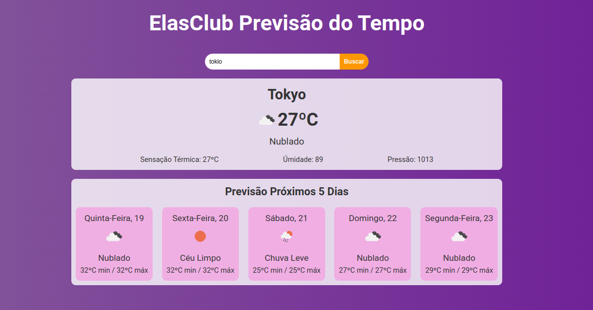

# App de Previsão do Tempo

## Descrição
Este projeto é um aplicativo de previsão do tempo desenvolvido com React. O usuário pode buscar uma cidade e visualizar a previsão do tempo para hoje e os próximos 5 dias, utilizando a API OpenWeather.

## Tecnologias Utilizadas
- **ReactJS**: Biblioteca JavaScript para construção de interfaces de usuário.
- **OpenWeather API**: API para recuperar dados meteorológicos.

## Funcionalidades
- Busca de cidades para previsão do tempo.
- Exibição da previsão atual e dos próximos 5 dias.
- Design responsivo com CSS.

Projeto criado pelo tutorial [DevClub](https://www.youtube.com/watch?v=1mm_C-t_Vyg)
